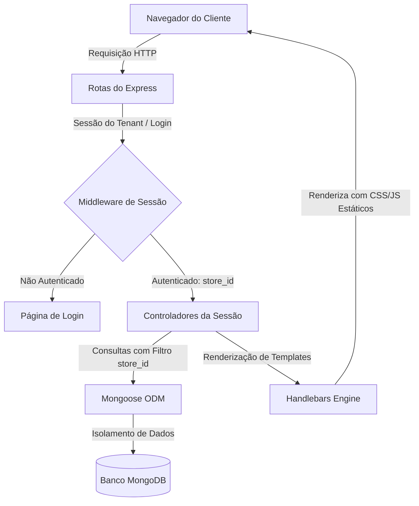
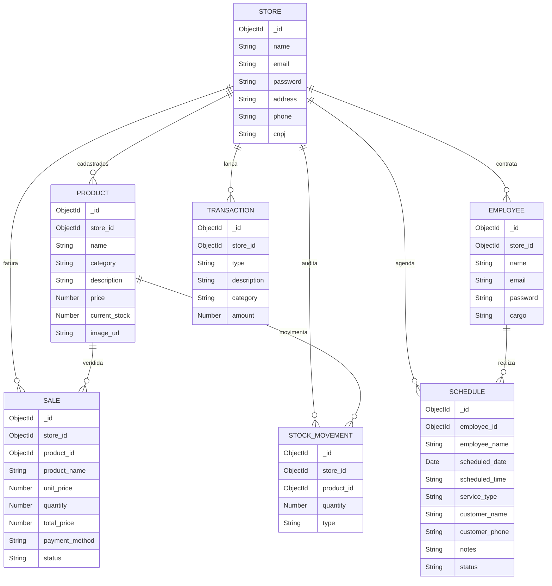

# StoreHost 🏪 | Sistema de Gestão Multi-tenant & ERP com Inteligência Artificial

[](LICENSE)
[](https://nodejs.org/)
[](https://www.mongodb.com/)
[](https://expressjs.com/)
[](https://deepmind.google/technologies/gemini/)

O **StoreHost** é um sistema de Planejamento de Recursos Empresariais (ERP) e Ponto de Venda (PDV) de arquitetura **multi-tenant** (multilojas), desenvolvido especificamente para micro e pequenos empreendedores, redes de lojas e franquias. 

O principal diferencial do sistema é o **StoreHost AI**, um assistente de negócios inteligente integrado ao painel que consome métricas reais da loja (faturamento, estoque, catálogo) para fornecer insights estratégicos em tempo real sobre vendas, finanças e gestão de estoque.

Este projeto foi estruturado com foco em boas práticas de engenharia de software, segurança de dados e alta performance, servindo como base prática e teórica para **Trabalhos de Conclusão de Curso (TCC)** em Engenharia de Software e Sistemas de Informação.

---

## 📌 Sumário
* [1. Visão Geral e Proposta](#1-visão-geral-e-proposta)
* [2. Arquitetura do Sistema](#2-arquitetura-do-sistema)
* [3. Funcionalidades Detalhadas](#3-funcionalidades-detalhadas)
* [4. Modelagem de Dados (Banco de Dados)](#4-modelagem-de-dados-banco-de-dados)
* [5. Stack Tecnológica](#5-stack-tecnológica)
* [6. Estrutura do Projeto](#6-estrutura-do-projeto)
* [7. Como Executar o Projeto Localmente](#7-como-executar-o-projeto-localmente)
* [8. Segurança e Boas Práticas](#8-segurança-e-boas-práticas)
* [9. 🎓 Guia de Slides para Apresentação do TCC](#9--guia-de-slides-para-apresentação-do-tcc)

---

## 1. Visão Geral e Proposta

### O Problema
Micro e pequenos comerciantes enfrentam dificuldades para consolidar informações financeiras, controle de estoque, agenda de serviços e vendas diárias. A maioria dos sistemas de ERP do mercado são caros, complexos demais, não oferecem isolamento robusto para redes de lojas (multi-tenant) e requerem conhecimento analítico avançado para interpretar dados financeiros.

### A Solução
O **StoreHost** simplifica a gestão empresarial ao centralizar as operações em um painel responsivo e minimalista. Ele oferece isolamento total dos dados de cada loja participante e reduz a barreira de análise de dados com o uso de **Inteligência Artificial Generativa**, agindo como um consultor de negócios virtual ativo 24/7.

---

## 2. Arquitetura do Sistema

O sistema adota o padrão de design **MVC (Model-View-Controller)** com arquitetura monolítica modularizada em **ES Modules (Node.js)**. 

### Fluxo de Funcionamento (Multi-tenant)


---

## 3. Funcionalidades Detalhadas

### 📊 Painel Executivo (Dashboard)
* **Indicadores em Tempo Real (KPIs):** Total de faturamento, total de produtos cadastrados, contagem de produtos com estoque crítico (baixo de 5 unidades) e despesas totais.
* **Gráficos Dinâmicos (Chart.js):** 
  * Gráfico de Linha/Área mostrando a evolução do faturamento mensal do ano corrente.
  * Gráfico de Rosca (Doughnut) exibindo a distribuição de despesas por categoria operacional.
* **Feed de Auditoria de Estoque:** Painel em tempo real mostrando as últimas 4 movimentações de estoque (entradas e saídas com tags coloridas).
* **Últimas Transações:** Tabela resumida das vendas mais recentes com detalhes de valor e horário formatado.

### ✨ Inteligência Artificial Integrada (StoreHost AI)
* Chatbot flutuante integrado diretamente na área restrita da plataforma.
* Envia um **prompt híbrido e contextualizado** para a API do **Gemini-2.5-flash** contendo os dados reais consolidados da loja do usuário (faturamento atual, número de produtos) mesclados com a pergunta do usuário.
* Retorna conselhos de negócios práticos e focados na realidade de faturamento da empresa.

### 📦 Catálogo de Produtos & Controle de Estoque
* **Cadastro Completo:** Nome, categoria, descrição, preço, estoque inicial e upload de imagem do produto gerenciado via **Multer** no servidor local.
* **Auditoria de Estoque:** Toda adição de quantidade ou saída manual de estoque gera um registro automático no modelo `StockMovement`.
* **Proteção contra Estoque Negativo:** O backend impede que qualquer movimentação reduza a quantidade do produto a menos de zero.

### 🛒 Ponto de Venda (PDV / Vendas)
* Registro de transações financeiras especificando quantidade, método de pagamento (Pix, Cartão de Crédito/Débito, Dinheiro).
* **Snapshot de Venda (Garantia de Histórico):** O sistema copia e grava em definitivo os atributos `product_name` e `unit_price` no documento da venda. Caso o produto venha a ser editado (mudança de preço ou nome) ou excluído posteriormente, o histórico de relatórios e faturamento passado permanece intacto e auditável.

### 💰 Gestão Financeira Completa
* Controle total de fluxo de caixa registrando entradas (`income`) e saídas (`expense`).
* Categorização de despesas (Ex: Logística, Aluguel, Salários, Marketing) para análise automática nos gráficos do painel de controle.

### 📅 Agenda de Serviços (Estilo Apple Calendar)
* Módulo dedicado para negócios que oferecem agendamento (salões de beleza, consultórios, mecânicas, pet shops).
* Cartões visuais contendo nome do cliente, telefone, data, horário do serviço, observações adicionais e responsável da equipe.
* Estados dinâmicos de agendamento: `Pendente`, `Confirmado`, `Concluído` e `Cancelado`.

---

## 4. Modelagem de Dados (Banco de Dados)

O banco de dados é modelado utilizando o MongoDB de forma relacional via referências do Mongoose (`ObjectId`). O isolamento por loja é mantido incluindo o campo `store_id` como chave estrangeira indexada.



---

## 5. Stack Tecnológica

* **Servidor e Backend:** [Node.js](https://nodejs.org/) (ES Modules) com framework [Express.js](https://expressjs.com/).
* **Banco de Dados NoSQL:** [MongoDB](https://www.mongodb.com/) com a biblioteca de modelagem orientada a objetos [Mongoose](https://mongoosejs.com/).
* **Autenticação e Sessão:** [express-session](https://www.npmjs.com/package/express-session) para persistência de logins de administradores no servidor de sessão.
* **Segurança de Senhas:** [bcrypt](https://www.npmjs.com/package/bcrypt) para hashing unidirecional de senhas antes do armazenamento no banco de dados.
* **Motor de Visualização (Template Engine):** [Express Handlebars](https://github.com/express-handlebars/express-handlebars) para páginas dinâmicas server-side rendering.
* **Estilização de Interface:** Vanilla CSS estruturado de forma responsiva + componentes de grade do [Bootstrap 5](https://getbootstrap.com/).
* **Visualização de Dados:** [Chart.js](https://www.chartjs.org/) no frontend para geração de gráficos informativos.
* **IA Generativa:** REST API nativa do [Google Gemini (Modelo Gemini 2.5/3.5 Flash)](https://ai.google.dev/).

---

## 6. Estrutura do Projeto

```text
stroreHost/
├── index.js                  # Ponto de entrada da aplicação (configuração do servidor Express e Rotas)
├── package.json              # Dependências e scripts npm
├── README.md                 # Documentação principal
├── public/                   # Arquivos estáticos (acessíveis publicamente)
│   ├── css/                  # Estilos em CSS Vanilla
│   ├── js/                   # Scripts JS do lado do cliente
│   ├── uploads/              # Uploads de fotos dos produtos realizados via Multer
│   └── mockup.png            # Imagem de demonstração da interface na Landing Page
└── src/                      # Código fonte da aplicação
    ├── controllers/          # Controladores (Regras de negócio e intermediação View <-> Model)
    │   ├── SessionRegister.js
    │   ├── SessionLogin.js
    │   ├── SessionDashboard.js
    │   ├── SessionProduct.js
    │   ├── SessionStock.js
    │   ├── SessionEmployee.js
    │   ├── SessionSale.js
    │   ├── SessionFinance.js
    │   ├── SessionScheduling.js
    │   └── SessionAIFeedback.js
    ├── models/               # Modelos do Mongoose (Schemas do Banco de Dados)
    │   ├── Store.js
    │   ├── Product.js
    │   ├── Employee.js
    │   ├── Sale.js
    │   ├── StockMovement.js
    │   ├── Transaction.js
    │   └── Schedule.js
    └── views/                # Telas da aplicação (Templates em Handlebars)
        ├── layouts/          # Estruturas padrão (main, dashboard, login, register)
        ├── partials/         # Componentes parciais reutilizáveis
        └── (telas).handlebars # Telas do sistema (product, stock, sale, employee, etc.)
```

---

## 7. Como Executar o Projeto Localmente

### Pré-requisitos
* Ter instalado o [Node.js](https://nodejs.org/) (versão 20 ou superior).
* Ter um banco de dados [MongoDB](https://www.mongodb.com/) rodando localmente ou uma conta no [MongoDB Atlas](https://www.mongodb.com/cloud/atlas).
* Obter uma chave de API gratuita do [Google AI Studio](https://aistudio.google.com/) para habilitar a funcionalidade de chat com inteligência artificial.

### Passo a Passo

1. **Clonar o Repositório:**
   ```bash
   git clone https://github.com/seu-usuario/storehost.git
   cd storehost
   ```

2. **Instalar Dependências:**
   ```bash
   npm install
   ```

3. **Configurar as Variáveis de Ambiente:**
   Crie um arquivo `.env` na raiz do projeto contendo as seguintes variáveis:
   ```env
   PORT=8080
   MONGO_URL=mongodb://localhost:27017/storehost
   GEMINI_API_KEY=sua_chave_do_gemini_api_aqui
   ```

4. **Executar a Aplicação:**
   Para desenvolvimento com reinicialização automática (Nodemon):
   ```bash
   npm run start
   ```

5. **Acessar no Navegador:**
   Abra seu navegador e digite o endereço: `http://localhost:8080`

---

## 8. Segurança e Boas Práticas

1. **Isolamento de Tenants:** Todas as rotas críticas do painel filtram documentos do banco de dados passando a variável `req.session.storeId`. Isso garante que uma loja nunca visualize os dados de outra loja, mesmo se as requisições forem alteradas no frontend.
2. **Criptografia de Senhas:** Nenhuma senha é salva em texto limpo. O `bcrypt` adiciona um salt e realiza o hashing seguro antes do banco persistir a conta.
3. **Persistência de Preço de Vendas (PDV):** Protege contra manipulações financeiras retroativas. Ao cadastrar uma venda, os dados do preço não são pegos por consulta ao produto no momento de ler relatórios; em vez disso, são persistidos na transação histórica da venda (padrão Snapshot).
4. **Desempenho com Assincronia Parallel (Promise.all):** O controlador do dashboard principal executa 8 consultas assíncronas ao MongoDB em paralelo no banco (`Promise.all`), otimizando o carregamento da página mesmo sob alta carga de dados históricos.

---

<<<<<<< HEAD
## 9. 🎓 Guia de Slides para Apresentação do TCC

Para ajudar na estruturação da sua apresentação de TCC perante a banca examinadora, criamos um arquivo completo com o roteiro de slides detalhado contendo a proposta visual, tópicos de cada tela e roteiro de fala passo a passo.

👉 **[Acesse aqui o Roteiro Completo de Slides para o TCC (TCC_SLIDES.md)](file:///Users/heitorreis/tcc/stroreHost/TCC_SLIDES.md)**

*O roteiro está dividido em 10 slides estratégicos para cobrir desde a problemática de mercado até a demonstração técnica e perguntas da banca.*

---

=======
>>>>>>> 1d31796f5ff51e66215b2b160072ec8cf68e388e
Desenvolvido com 💙 para fins acadêmicos e práticos de empreendedorismo digital.
